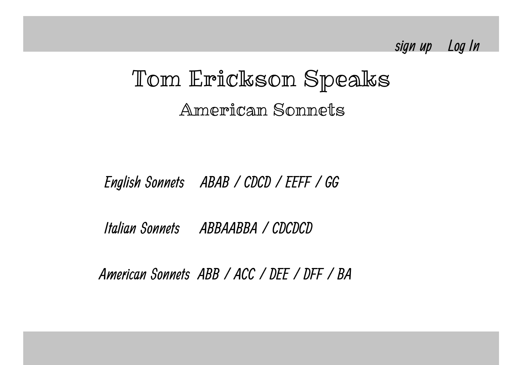
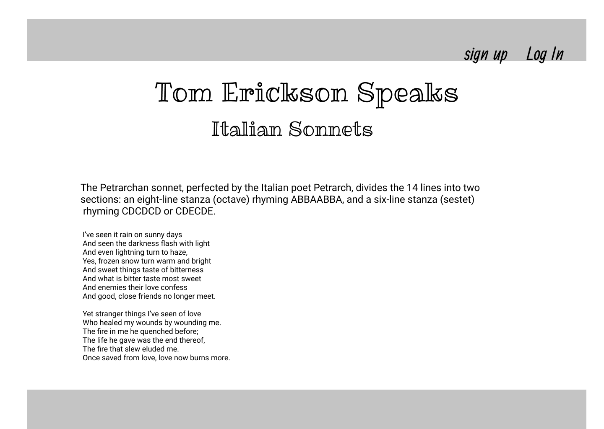
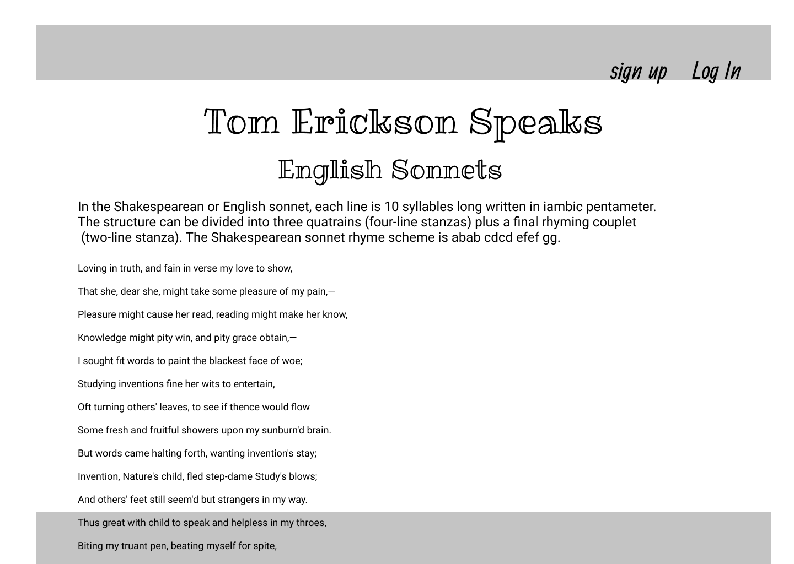
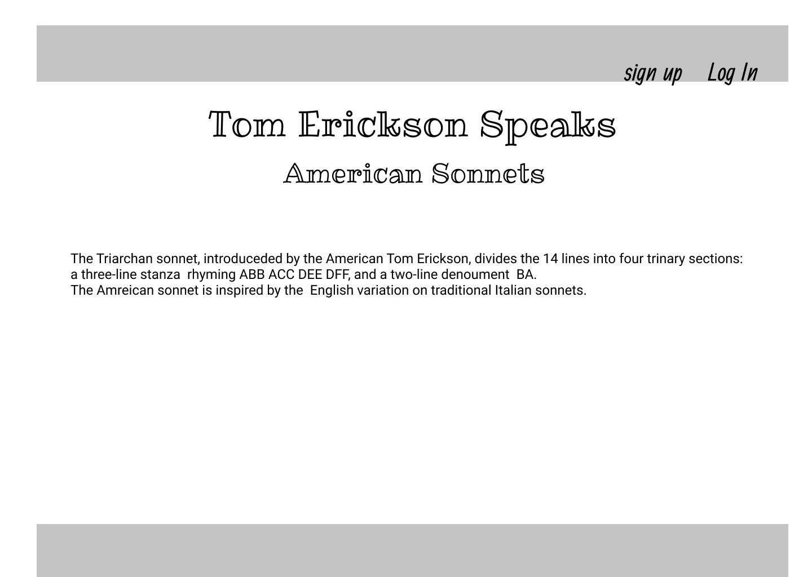
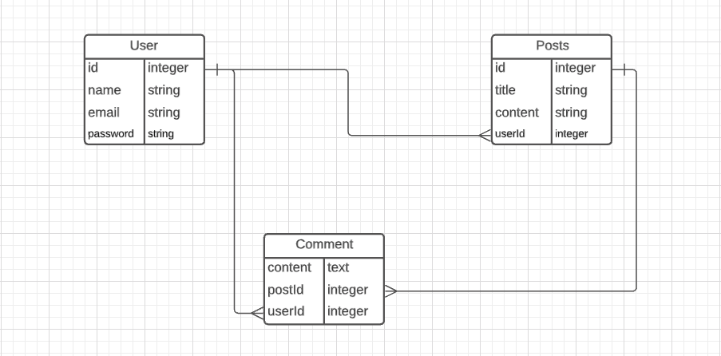

<h1>Tom Erickson Speaks </h1>
<h1> " An Exploration Into Sonnets" </h1>

<h2> "We all have an inner poet, outward bound,,,</h2>

<iframe style="border: 1px solid rgba(0, 0, 0, 0.1);" width="800" height="450" src="https://www.figma.com/embed?embed_host=share&url=https%3A%2F%2Fwww.figma.com%2Ffile%2FVfYb7AOb0fmnhdFCqf90DU%2FTom-Erickson-Speaks%3Fnode-id%3D0%253A1" allowfullscreen></iframe>

<h2>As the page opens, there is simplicity,,, sign-up or log-in and choose a style for expression" </h2>
<h3>There are no vivid distractions to take away from one's inner thoughts or distract from a focus on contribution. This page is here for one to be contemplative, calm, and as a blank slate for a profound spirit of creativity, compassion , and empathic joy</h3>

- 

<h2> Enquire within; On this page you find latin influences. All are welcome to contribute and comment and remove their own handiwork</h2>

- 

<h2>Enquire within; On this page you find Northumbrian-Flemish influences. All are welcome to contribute and comment and remove their own handiwork</h2>

- 

<h2>Enquire within; On this page you find the sum of our past in the present. All are welcome to contribute and comment and remove their own handiwork</h2>

- 

<h2> Here we see the relations; one-to-many. Each user may post and comment</h2>

- 

<h2> Each user can have many posts. Each user can have many comments. Each post can have many comments,</h2>
